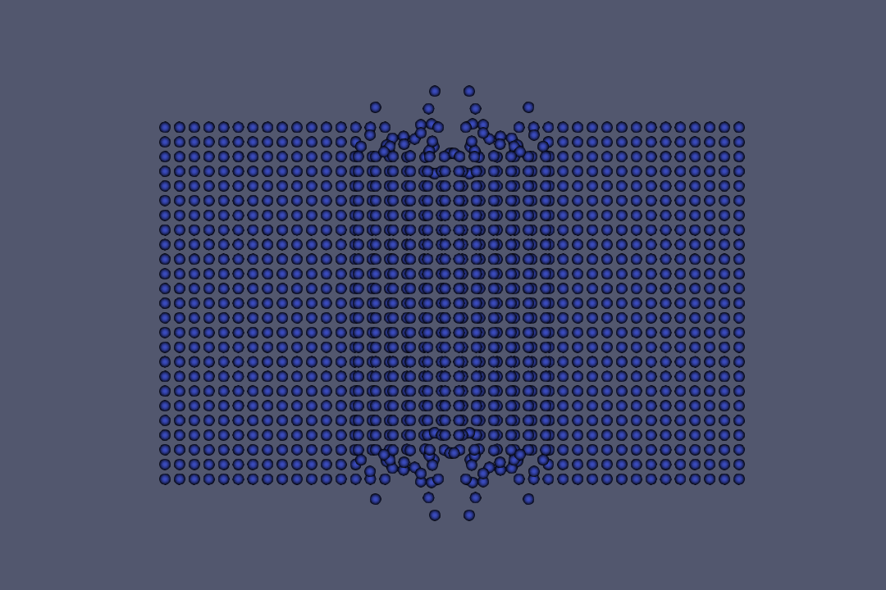
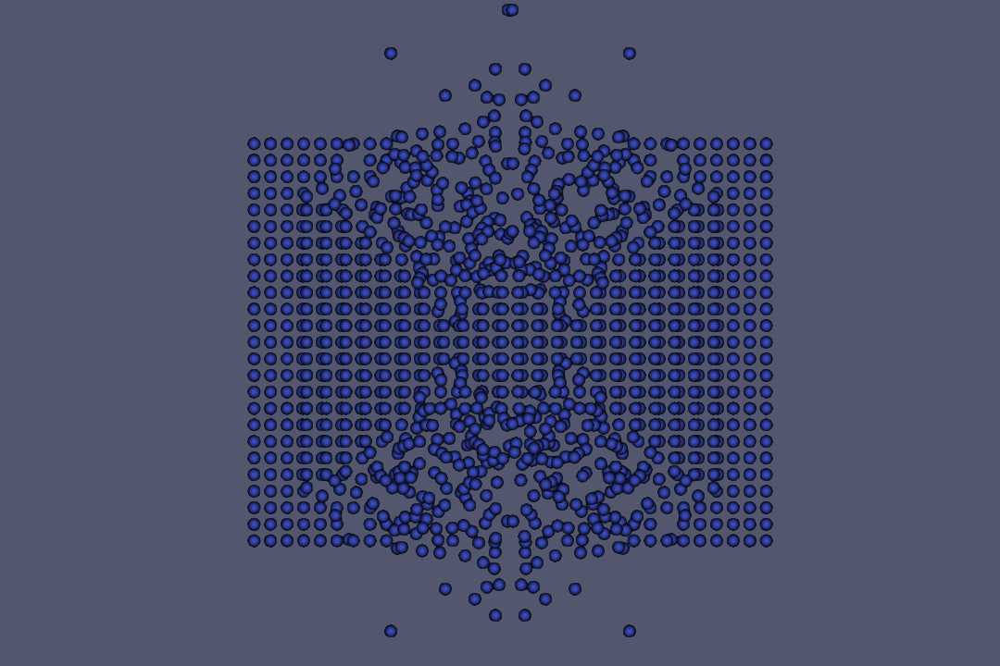
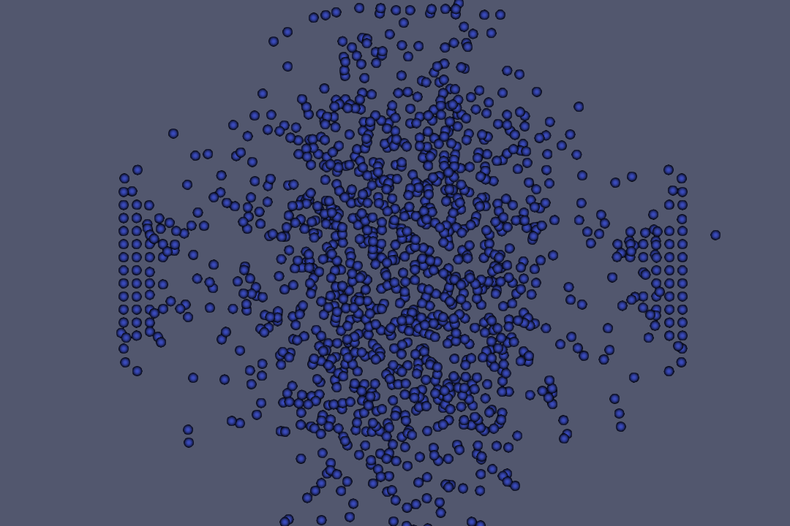

# Lennard-Jones-Potential-Simulation
This project is a 3D simulation of *N* particles. Each particle is characterized by its position, mass, velocity and force. To describe the particle interaction, we calculate the forces according to the Lennard-Jones potential. This approximates the intermolecular interaction of two atoms and acts repulsive at short distances and attractive at long distances.

In our brute-force approach, the calculation of the force over *N* particles iterates over all *N* particles, which scales with **O(N^2)**. To improve this, we divide the space into cells, so that each particle is assigned to one cell, depending on its position. We use two data structures for this: A cell list, which refers to one particle in each cell, and a particle linked list, which refers to other particles with the same cell.

This project was developed in a team of three.

# Force Calculation Strategies
We have implemented different strategies for the force calculation:
- **Brute-Froce Strategy:** Each particle is assigned to a GPU thread. This thread calculates the force only for its particle. For each particle we iterate over all *N* particles.
- **Particle-Parallel Binning Strategy:** Each particle is assigned to a GPU thread. This thread calculates the force only for its particle. The particle neighbors are determined by iterating over the neighbor cells.
- **Cell-Parallel Binning Strategy:** Each cell is assigned to a GPU thread. This thread calculates the force for all particles within its cell. The particle neighbors are determined by iterating over the neighbor cells.
- **Neighbor List Strategy:** Each particle is assigned to a GPU thread. This thread calculates the force only for its particle. To iterate over the neighbors of this particle, an additional neighbor list is used.

# Output
As output we use the VTK file format. 
A 2D visualisation of an example input can be seen below.

